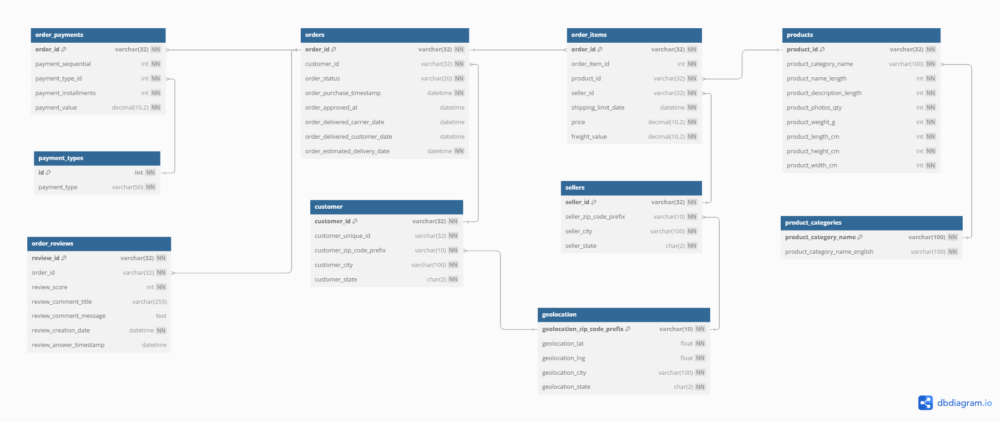

---
hide:
  - navigation
---

# Modelo Entidade-Relacionamento

> Abaixo está o diagrama que representa o modelo entidade-relacionamento com suas tabelas e relacionamentos:

> O modelo foi criado com base nos dados disponíveis no dataset de vendas de um e-commerce.

---

## Tabelas

- **customers**: Dados dos clientes, incluindo identificação única e localização.
- **orders**: Informações sobre cada pedido realizado, como status, datas de aprovação e entrega.
- **order_items**: Itens de cada pedido, com produtos, vendedores, valores e prazos de envio.
- **products**: Informações detalhadas sobre os produtos vendidos, como categoria, dimensões e peso.
- **product_categories**: Categorias de produtos, com nome em português e inglês.
- **sellers**: Dados dos vendedores, incluindo localização e CEP.
- **geolocation**: Coordenadas geográficas e informações de localização por prefixo de CEP.
- **order_payments**: Pagamentos realizados em cada pedido, com tipo, parcelas e valores.
- **payment_types**: Tipos de pagamento disponíveis (cartão, boleto, etc).
- **order_reviews**: Avaliações deixadas pelos clientes, incluindo nota, comentário e data.

