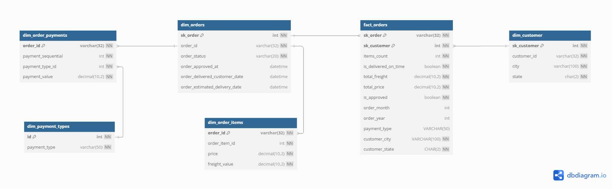

---
hide:
  - navigation
---

# Modelo Dimensional

---

> Abaixo está o diagrama representando as tabelas fato e suas dimensões:

## Fato: `fact_orders`

Armazena informações de pedidos realizados, incluindo quantidades de itens, status de entrega, valores totais e dados de aprovação.

### Principais atributos:
- `items_count`: quantidade de itens no pedido
- `is_delivered_on_time`: flag indicando se a entrega foi no prazo
- `total_freight`: valor total do frete
- `total_price`: valor total dos produtos
- `is_approved`: flag indicando se o pedido foi aprovado
- `order_year` e `order_month`: Ano e Mês da data de aprovação
- `payment_type`: forma de pagamento utilizada
- `customer_city` e `customer_state`: localização do cliente

---

## Dimensões

- `dim_orders`: Contém detalhes do pedido como status, data de aprovação, entrega e previsão de entrega.
- `dim_customer`: Contém dados dos clientes como cidade e estado.
- `dim_order_items`: Detalha os itens de cada pedido, incluindo preço e valor de frete por item.
- `dim_order_payments`: Armazena as informações de pagamento por pedido, incluindo valor e tipo de pagamento.
- `dim_payment_types`: Lista os tipos de pagamento disponíveis (cartão de crédito, boleto, pix, etc.).

---

 

Este modelo permite as seguintes análises:

KPIs 

- Taxa de entregas no prazo 
- Frete médio por pedido
- Ticket médio por pedido
- Taxa de aprovação de pedido

Métricas

- Distribuição dos tipos de pagamento
- Cidades dos clientes que mais compraram
